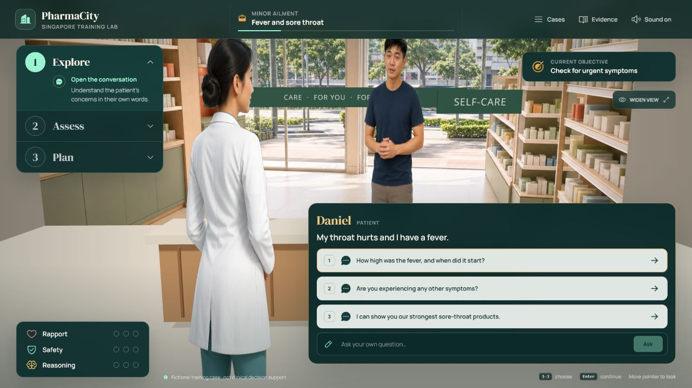
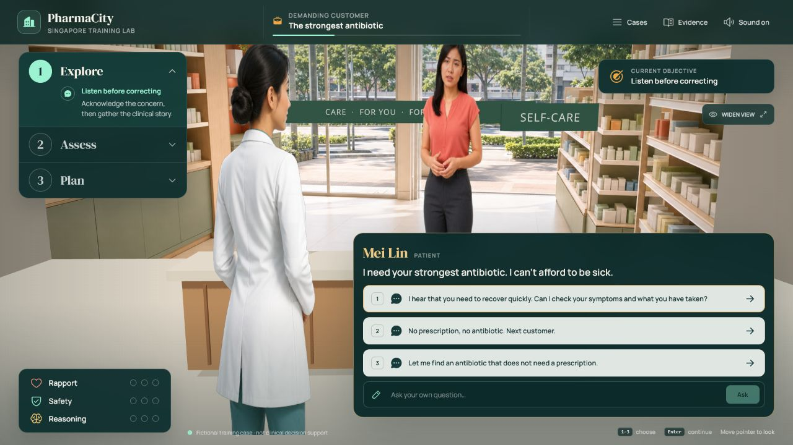
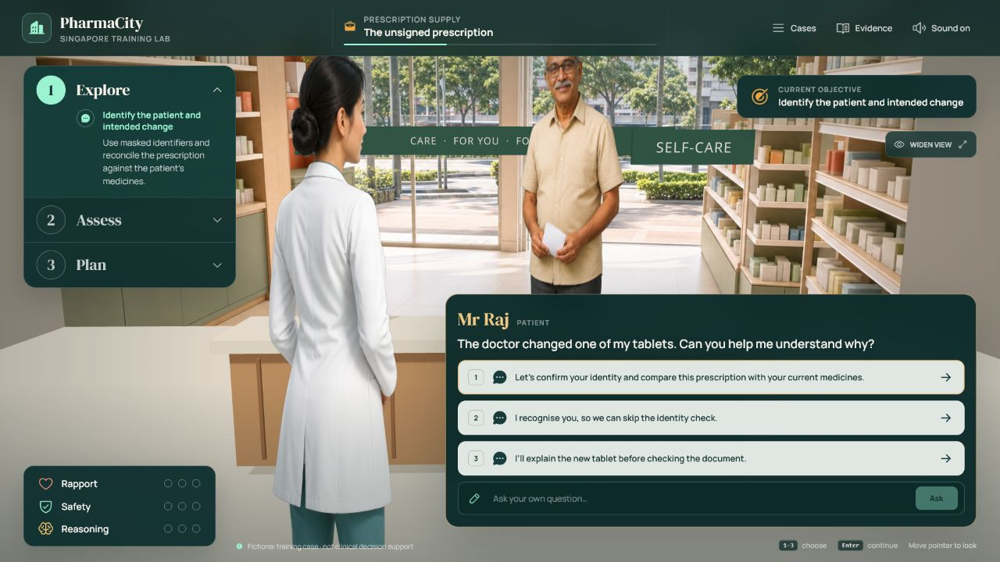

# PharmaCity

PharmaCity is a browser-based 3D training prototype for community-pharmacy professionals in Singapore. It combines a real-time WebGL pharmacy, life-like generated NPCs, branching dialogue, safety-critical decisions, competency feedback, and an end-of-case debrief.

## At a glance



The player works from an over-the-shoulder pharmacist view while the interface keeps the current objective, **Explore → Assess → Plan** progression, patient dialogue, and live competency signals visible.

- Interview life-like patients using three scored responses or a free-text question.
- Identify red flags, reconcile medicines, validate prescriptions, and communicate safely.
- Receive immediate decision feedback and a structured end-of-case debrief.
- Switch between cases from the in-game library without leaving the simulation.

### Scenario gallery

| Demanding customer | Prescription supply |
| --- | --- |
|  |  |
| De-escalate an inappropriate antibiotic request while gathering the clinical story. | Validate an incomplete prescription, reconcile medicines, and counsel with teach-back. |

## Playable cases

- **Fever and sore throat** — triage, red-flag screening, medication reconciliation, referral, and safety-netting.
- **The strongest antibiotic** — de-escalation, appropriate antibiotic counselling, duplicate-ingredient prevention, and self-care advice.
- **The unsigned prescription** — identity checks, prescription validation, clarification, labelling, counselling, and teach-back.

The opening case is guided through **Explore → Assess → Plan**. Choose responses with the mouse or number keys `1`–`3`; press `Enter` to continue after feedback. The free-text field provides deterministic patient responses without sending data to an external service.

## Run locally

```powershell
npm.cmd install
npm.cmd run dev
```
****
Production and scenario checks:

```powershell
npm.cmd test
npm.cmd run build
```

## Stack

- React and Vite
- Three.js through React Three Fiber
- Phosphor icons
- Local Manrope and DM Serif Display fonts
- Project-bound generated character and environment assets

## Clinical-use boundary

This is an educational prototype, not clinical decision support. The cases use fictional patients and masked identifiers. Before training deployment, all clinical, legal, medicine-classification, and workflow content must be reviewed and signed off by a Singapore-registered pharmacist. Real product classifications must be checked against current Health Sciences Authority records.

The in-game Evidence drawer links to the Singapore Pharmacy Council Code of Ethics, HealthHub guidance, Singapore therapeutic-product regulations, and Ministry of Health emergency-care guidance.
